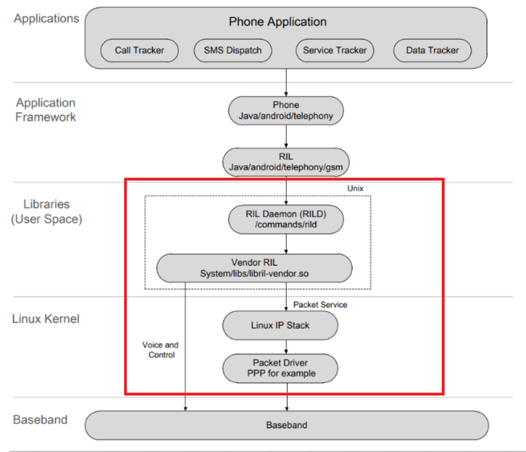
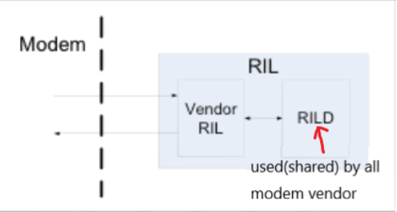
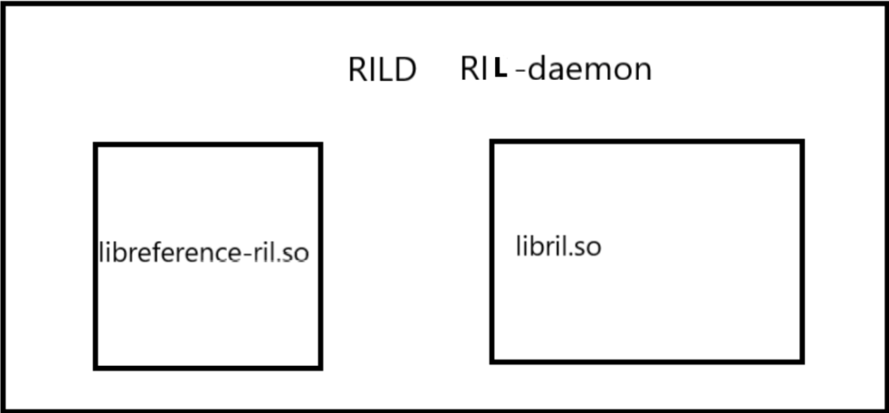
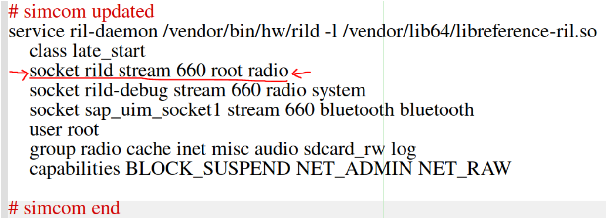
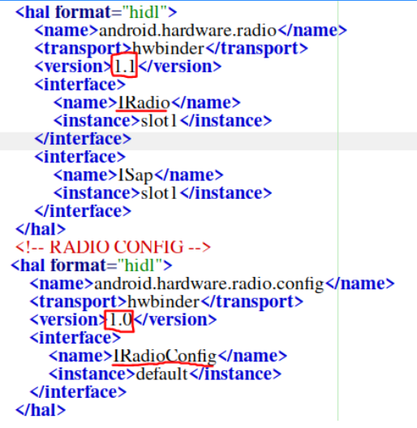
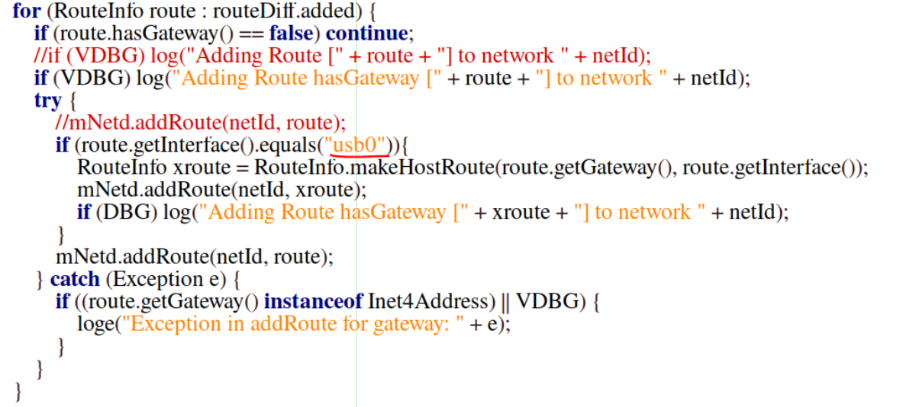
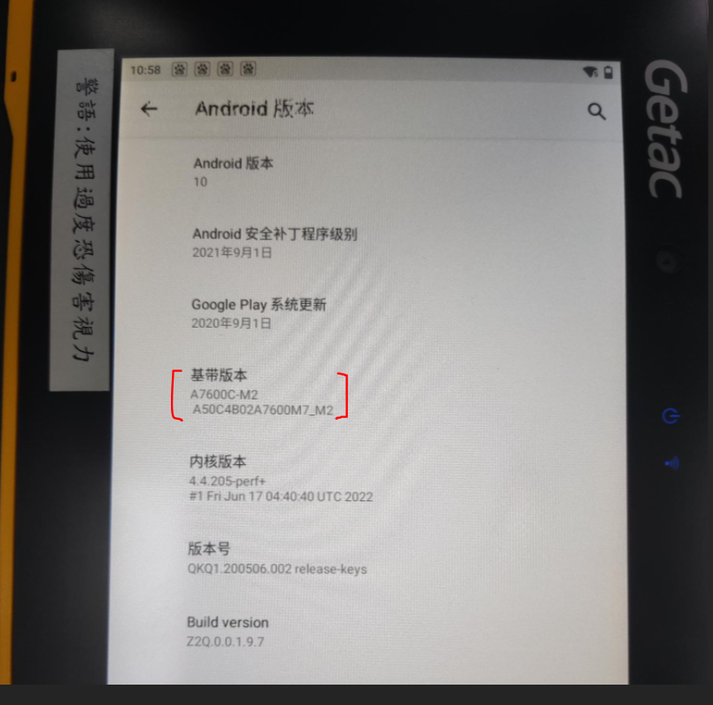

# Modem-Porting-tutorial

# **CTA SIMCOM PORTING**

# **Outline**

- Some information
- Introduction
- RILC ( including RILD )
- HIDL
- RILJ
- Result

# **Information**
* Android version: Android 10 (CTA)
* Kernel version: Linux version 4.4.205
* connection type: RNDISupdated date: 2022/6/17
* platform: Qualcomm sdm660_64
* modem: SIMCOM A7600C

# **Introduction**

The following diagram is the structure of RIL in Android.(above Android 8.0 version) 
The red rectangle in the diagram is basically where we need to work with. 

Basically I will divide the red rectangle into 4 parts:
- kernel driver
- RILD and vendor RIL
- HIDL
- RILJ.

> In this article, we will not talk about kernel driver because we can do it without pain by just following the porting guide oftentimes. But as a reminder, remember to open up drivers required by your connection type. 

# **RILD and vendor RIL**

RIL under RILJ in Android can be divided into two parts: 
- one part is RIL Daemon, it used to use *"socket"* to communicate with framework and process RIL events. However, after Android 8.0, we use "HIDL" to do such work. 
- The second part is implemented by mobile phone vendor, let's called it Vendor RIL. 

- The reason we have two parts is because Google splits RIL that is closely to modem (i.e. specific to every modem vendor) as Vendor RIL and the part that all modem vendors share/use apart. Like the following diagram:

Now, we already know RIL can be "mainly" devided into two parts, however, how the diagram is related to the real-world cases? 

> First, Vendor RIL usually provided in the form of libreference-ril.so. It transforms the request from RILJ (Java layer) to AT commands. Thus we know that every modem vendor has their own libreference-ril.so.

> Second, RILD (in the above diagram) is the part used or shared by all modem vendors. Usually it is provided in the form of libril.so. 

* Note that sometimes we call Vendor RIL and RILD together as "rild" because libril.so and libreference-ril.so "resides" in RIL Daemon(rild). Be careful about the name collisions. To avoid confusion, I will use "rild" for RIL Daemon and "RILD" for the part that used or shared by all modem vendors.

* So as you what you guess, the "RIL" in the above diagram is actually rild.

>To summary, there are two parts in rild. One is libreference-ril.so(RILD) and the other is libril.so(vendor RIL). They both "reside" in rild. "rild" will link the libril.so and libreference-ril.so together. And libril.so will give the request from RILJ to libreference-ril.so then libreference-ril.so will turn this request to AT command to communicate with modem.Now, let me re-draw.

A more detailed diagram is as follows:

 

Now, we will talk about how ril-daemon (rild) is executed. Basically, we will write a service to execute it (in this example, I wrote it in init.qcom.rc), as follows:

>Notice that you need to do files copying like `PRODUCT_COPY_FILES += vendor/swi/simcom/rild:vendor/bin/hw/rild` and setup rild property. These part usually state in porting guide, so we skip here.

Lastly, sometimes you may hear RILC. It is nothing but rild, libril, libreference-ril all together.

# **HIDL**
HIDL communicates with RILJ and RILD. So it is very important in modem porting, if you don't see much information about RILJ or only the initialization of RILJ log, it is likely that your HIDL doesn't set up properly. 

>For example, if 4G or other mobile network icon doesn't appear on your device, you can check whether it is because of HIDL.

To successfully communicate with RILJ, we need IRadio and IRadioConfig in hidl (sometimes we may need IOemHook). Make sure the version of IRadio and IRadioConfig is what your modem using. In my case, this modem uses IRadio 1.1 and IRadioConfig 1.0.

Files you may check:
1. manifest.xml (device/qcom/${yout_platform})

2. vendor_framework_compatibility_matrix.xml (device/qcom/common)- notice position of this file may vary.

3. compatability_matrix.xml- notice position of this file may vary.

In android 10, the compiler asked me to add IRadio and IRadioConfig in both these 3 files, however, in Android 9, if I add them in all these 3 files, the compilation fails. So this part you may try and error which files to add it in.

# **RILJ**

RILJ is a general name for RIL-related java classes in framework, its main core is RIL.java and it is located at frameworks/opt/telephony/src/java/com/android/internal/telephony/RIL.java.

Bascially RILJ handles two types of request : solicited request and unsolicited request. 
* Unsolicited request is lauched by hardware modem. For example, someone give you a ring.
* Solicited request is the opposite, it is lauched by RILJ. Like when you choose 2G/3G/4G network in your settings.

For modem porting, we rarely change RILJ. But notice that, we may need to change frameworks/base/services/core/java/com/android/server/ConnectivityService.java if we use different network interface. For example, the original network interface uses "eth0" for SIMCOM modem. After SIMCOM updated their firmware, they're using "usb0" as network interface.

# **Result**

